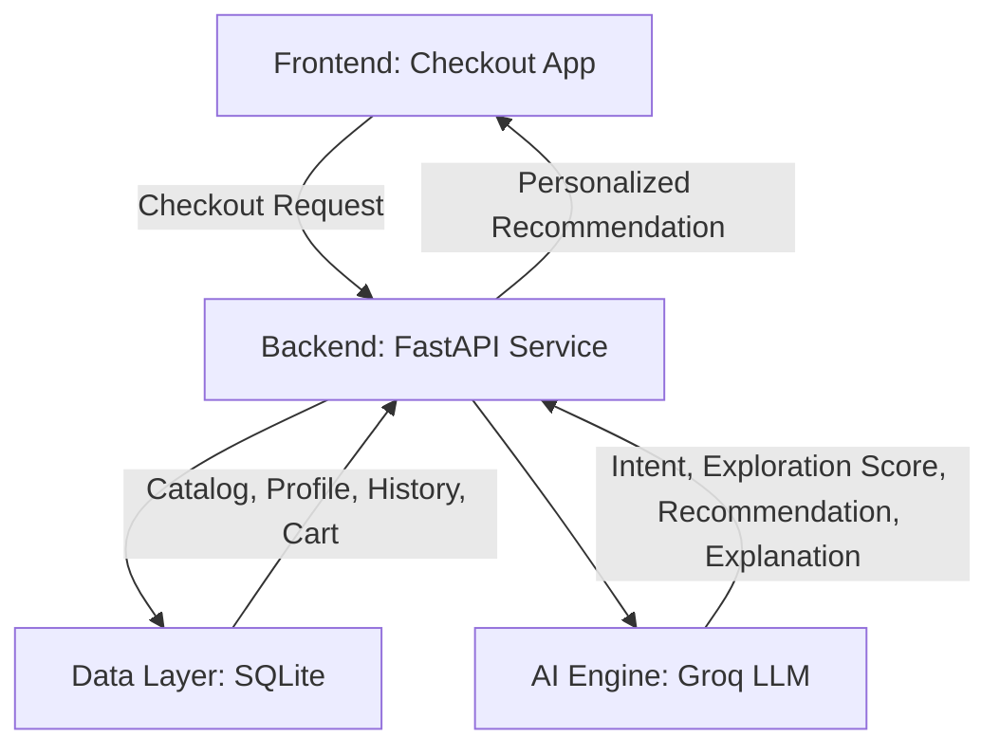

# Architectural Plan: Blinkit Smart Discovery MVP

## 1. Overview
The Blinkit Smart Discovery MVP aims to increase cross-category purchases by recommending a single relevant product from a new category during the checkout process. The architecture will rely on a modern web frontend, a Python-based backend to orchestrate the AI logic, and a mock data layer to simulate the Blinkit environment.

## 2. System Architecture

### 2.1 Frontend (User Interface)
- **Technology:** React (via Vite) + Vanilla CSS
- **Design Philosophy:** Rich aesthetics, dynamic micro-animations, and a premium "Blinkit-like" feel.
- **Key Components:**
  - **Cart Summary View:** Displays the user's current intent-driven shopping list.
  - **Smart Discovery Module:** Appears during checkout. It will show a single recommended product, a personalized explanation for *why* it's recommended, and simple "Add to Cart" or "Skip" actions.

### 2.2 Backend (API Service)
- **Technology:** Python with FastAPI
- **Responsibilities:**
  - Orchestrate the recommendation workflow.
  - Fetch user context and product data.
  - Prompt the AI engine to generate contextual recommendations.
- **Key Endpoints:**
  - `GET /api/cart/{user_id}`: Retrieves the user's current cart.
  - `POST /api/recommend/{user_id}`: Triggers the AI workflow to generate the recommendation and explanation based on the cart and history.

### 2.3 AI Engine (Core Logic)
- **Technology:** Groq API (LLM)
- **Workflow:**
  1. **Context Aggregation:** Combine the user's profile, past purchase history, and current cart items into a structured prompt.
  2. **Intent Detection:** Analyze the current cart to determine the mission of the shopping trip (e.g., "baking a cake", "stocking up on snacks").
  3. **Gap Analysis & Exploration Scoring:** Identify categories the user has never purchased from that logically complement the current intent.
  4. **Product Selection:** Select a single, high-confidence product from the new category.
  5. **Explanation Generation:** Generate a concise, personalized explanation bridging the current intent and the new product.

### 2.4 Data Layer (Synthetic Data)
- **Technology:** SQLite Database (`discovery_engine.db`)
- **Entities:**
  - **Product Catalog:** Categories, product names, descriptions, prices, tags.
  - **Customer Profiles:** Demographics, preferred categories, exploration score.
  - **Purchase History:** Past orders to identify repetitive behavior.
  - **Current Cart:** Simulates a user's active session.

## 3. Implementation Phases

**Phase 1: Data Mocking & Foundation**
- Generate synthetic datasets for the product catalog, users, and histories.
- Setup the Python FastAPI backend and simple endpoints to serve this data.

**Phase 2: AI Integration**
- Integrate the Groq API.
- Develop the prompt engineering pipeline to execute the 10-step AI workflow outlined in the problem statement.
- Validate that the AI consistently recommends products from *new* categories with sensible explanations.

**Phase 3: Frontend Development**
- Scaffold the Vite + React app.
- Build the premium checkout UI with the Smart Discovery recommendation widget.
- Connect the frontend to the backend API.

## 4. Open Questions & Assumptions
- Frontend framework is set to React via Vite.
